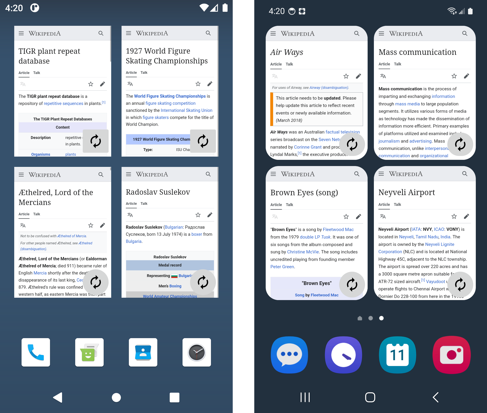

# Web Widgets

A demonstration of drawing rendered `WebView` content into App Widget images
along with various features, for both `RemoteViews` and Glance.

This project contains complete working examples to supplement those outlined in
[this Stack Overflow post][so-post]. There might be relevant information or
details there that I've overlooked here, and vice versa.

 

## Contents

- [Overview](#overview)
- [RemoteViews](#remoteviews)
- [Glance](#glance)
- [Notes](#notes)

 

## Overview

- Each framework has three versions: Minimal, Simple, and Scroll.

  - The Minimal ones are rather bare-bones; just enough to show as busy before
    displaying a static image or a failure message.

  - The Simple versions provide reload buttons, create more efficient images,
    and are clickable to allow opening their pages in a browser app.

  - The Scroll ones have the same features as the Simple, but the image is
    created to be (almost) as tall as is allowed by the App Widget API's size
    limit, and is then displayed as the only item in a `ListView` or
    `LazyColumn`.

- All of the Widgets use the same overall method to generate their images: a
  `WebView` is instantiated and, in order to enable rendering, attached to
  `WindowManager` inside a zero-by-zero `FrameLayout`. A page is then loaded,
  laid out, and drawn to a `Bitmap` that's displayed in the Widget, after which
  everything is cleaned up. For the non-Minimal ones, this is consolidated in a
  separate helper class named [`WebShooter`][web-shooter].

- Neither framework's examples really do much as far as data persistence goes.
  The `RemoteViews` versions do save state to disk, but only because
  `AppWidgetProvider` instances are short-lived, and a new one is created for
  each Widget action. The Glance versions manage to use only runtime variables
  because `GlanceAppWidget`s hang around until the process is killed, which is
  sufficient for a demo but probably not so for production.

- All of the examples assume that the page will load relatively quickly. Each
  one uses only the time available to it from its own component; i.e., there are
  no separate `Worker`s or loader `Service`s. Consult the corresponding sections
  below for the individual Widgets' respective time limits. In production, I'd
  suggest using `Worker`s for most setups. [This official Glance sample][sample]
  has an `ImageWorker` that's very close to what would be needed here.

 

## RemoteViews

### Minimal

[`RemoteViewsMinimalWidget`][remoteviews-minimal]

The Minimal version simply displays a static image or a failure message after
showing an indeterminate indicator while busy. The actual image is the same
width as the screen and half its height, though it's obviously scaled down in
the Widget. There's nothing special about the height measure; I cut it in half
so it kinda fits OK in a 2x2 portrait Widget.

A coroutine is launched from the `AppWidgetProvider`'s `onUpdate()` to handle
the page load, layout, and draw. It takes advantage of `BroadcastReceiver`'s
`goAsync()` functionality to get about 10 seconds to finish its work.

### Simple

[`RemoteViewsSimpleWidget`][remoteviews-simple]

The Simple one adds a reload button to force a new random page, and the image
itself can be clicked to open the currently displayed page in a (separate)
browser app. Also, this one creates `Bitmap`s that are sized to match the Widget
rather than the screen, to cut down on overhead.

This one launches a coroutine from `onUpdate()` like the Minimal one, with the
same ~10-second timeout, but its `WebView` operations and draw routine are all
handled in the `WebShooter` class.

### Scroll

[`RemoteViewsScrollWidget`][remoteviews-scroll]

The Scroll version basically adds scrolling to the Simple one, though it's a bit
more complicated than it sounds. The only scrolling containers allowed in
`RemoteViews` are a handful of `AdapterView`s, so this one requires a separate
`RemoteViewsService` and `RemoteViewsFactory`, too.

The `WebShooter` work is handled in the `RemoteViewsFactory`, so there's plenty
of time available, but it's capped at 40 seconds to match the timeout for the
Glance Widgets.

Because of the unique setup here, this one ends up with a slightly different UI
if it errors or times out, as those messages are displayed in `ListView` items.
Also, since the reload button is handled in the `Provider` but the `WebShooter`
runs in the `Factory`, there's no easy way to disable that button if the shooter
figures out it can't draw. This one is mainly demonstrating how to use the time
available in the `Factory`, if that might be useful for your particular design,
so I didn't go to too much trouble to ensure feature parity here.

 

## Glance

Each Glance Widget has the same behavior and features as the corresponding
`RemoteViews` version, apart from the small UI difference for errors/timeouts in
Scroll. They all have the same timeout of 40 seconds, to come in under the
documentation's stated limit of "about 45 seconds" for `provideContent()`.

### Minimal

[`GlanceMinimalWidget`][glance-minimal]

The Minimal one again handles the load, layout, and draw directly, showing a
similar busy indicator and static results.

### Simple

[`BaseGlanceWidget`][glance-base],
[`GlanceSimpleWidget`][glance-simple]

Thanks to Glance's abstractions, the Simple and Scroll implementations are
nearly identical, and their common functionality is contained in
`BaseGlanceWidget`, which handles all of the `WebShooter` work.
`GlanceSimpleWidget` just tells the base class that the image should fit the
Widget's height, and then provides a static image `Composable`.

### Scroll

[`BaseGlanceWidget`][glance-base],
[`GlanceScrollWidget`][glance-scroll]

This one tells `BaseGlanceWidget` that the image height should be (almost) as
tall as possible, and provides a `LazyColumn` with a single item for the image.

 

## Notes

- One of the trickiest parts of this is figuring out when the `WebView` is ready
  to be drawn. Listening for the URL load to finish isn't enough, so a
  `VisualStateCallback` must be used, but even that doesn't appear to be
  sufficient a lot of the time.

  The [platform CTS helper class][cts-helper] that was consulted for the
  `postVisualStateCallback()` usage adds a `ViewTreeObserver.OnDrawListener`
  upon the visual callback, and then invalidates to cause an extra frame before
  drawing in order to ensure it's ready. Aside from the fact that the relevant
  platform test renders are extremely simplistic, that technique won't work here
  anyway because invalidation calls go up and down the hierarchy, and this setup
  will abort them at the `FrameLayout` because it has zero visible area.

  The demo originally used only `VisualStateCallback` as a readiness indicator,
  but that callback apparently fires soon after anything can be drawn, whether
  the render is complete or not, so it takes some guessing as to an appropriate
  delay. It's still useful, though, as an indication that the visual structure
  is pretty well mapped out, so we can get a height measure after it.

  Waiting for the full render is a different matter, and seemingly must involve
  some guesswork no matter how it's handled. Presently, the demo has three
  different options for the delay method, defined in the
  [`sealed interface DrawDelay`][draw-delay].

  - `Time` uses a simple `delay()` with an exact number of milliseconds.
  - `Frames` waits for the specified number of display frames to elapse, per
    `Choreographer`.
  - `Invalidations` monitors the `WebView`'s own `invalidate()` calls, and uses
    a `Flow` and `debounce()` to guess when it's done updating itself.

  `Invalidations` seems to be the most reliable, at least in my simple tests,
  but it assumes a static page. If you're loading something with animations or
  long-running scripts or the like, the `invalidate()` calls aren't going to be
  a reliable indicator. `Time`'s delay is probably the most intuitive option
  after that one, but there are likely cases where `Frames` makes more sense.

- There's apparently some issue with older emulators that can cause most pages
  to render blank, for some reason. I think it starts around Pie, going back in
  the versions. There are various suggestions for solutions out there, but I
  simply used `news.google.com` instead when testing on those because Google
  sites seem to work just fine, not counting the stuff missing due to JavaScript
  being disabled.

- All of the Widgets currently use Wikipedia for their pages. I am not
  affiliated with The Wikimedia Foundation nor any of its sites or
  organizations. It is simply a reliable, lightweight site with a random page
  functionality. The reproductions of small sections of various Wikipedia
  articles used in this document's graphics are believed to constitute fair use.

 

## License

MIT License

Copyright (c) 2024 Mike M.

Permission is hereby granted, free of charge, to any person obtaining a copy of
this software and associated documentation files (the "Software"), to deal in
the Software without restriction, including without limitation the rights to
use, copy, modify, merge, publish, distribute, sublicense, and/or sell copies of
the Software, and to permit persons to whom the Software is furnished to do so,
subject to the following conditions:

The above copyright notice and this permission notice shall be included in all
copies or substantial portions of the Software.

THE SOFTWARE IS PROVIDED "AS IS", WITHOUT WARRANTY OF ANY KIND, EXPRESS OR
IMPLIED, INCLUDING BUT NOT LIMITED TO THE WARRANTIES OF MERCHANTABILITY, FITNESS
FOR A PARTICULAR PURPOSE AND NONINFRINGEMENT. IN NO EVENT SHALL THE AUTHORS OR
COPYRIGHT HOLDERS BE LIABLE FOR ANY CLAIM, DAMAGES OR OTHER LIABILITY, WHETHER
IN AN ACTION OF CONTRACT, TORT OR OTHERWISE, ARISING FROM, OUT OF OR IN
CONNECTION WITH THE SOFTWARE OR THE USE OR OTHER DEALINGS IN THE SOFTWARE.

  [so-post]: https://stackoverflow.com/a/33981965

  [web-shooter]: app/src/main/kotlin/com/gonodono/webwidgets/WebShooter.kt

  [sample]: https://github.com/android/user-interface-samples/tree/main/AppWidget/app/src/main/java/com/example/android/appwidget/glance/image

  [remoteviews-minimal]: app/src/main/kotlin/com/gonodono/webwidgets/remoteviews/minimal/RemoteViewsMinimalWidget.kt

  [remoteviews-simple]: app/src/main/kotlin/com/gonodono/webwidgets/remoteviews/simple/RemoteViewsSimpleWidget.kt

  [remoteviews-scroll]: app/src/main/kotlin/com/gonodono/webwidgets/remoteviews/scroll/RemoteViewsScrollWidget.kt

  [glance-minimal]: app/src/main/kotlin/com/gonodono/webwidgets/glance/minimal/GlanceMinimalWidget.kt

  [glance-base]: app/src/main/kotlin/com/gonodono/webwidgets/glance/BaseGlanceWidget.kt

  [glance-simple]: app/src/main/kotlin/com/gonodono/webwidgets/glance/simple/GlanceSimpleWidget.kt

  [glance-scroll]: app/src/main/kotlin/com/gonodono/webwidgets/glance/scroll/GlanceScrollWidget.kt

  [cts-helper]: https://cs.android.com/android/platform/superproject/main/+/main:cts/tests/tests/uirendering/src/android/uirendering/cts/util/WebViewReadyHelper.java

  [draw-delay]: app/src/main/kotlin/com/gonodono/webwidgets/WebShooter.kt#L56