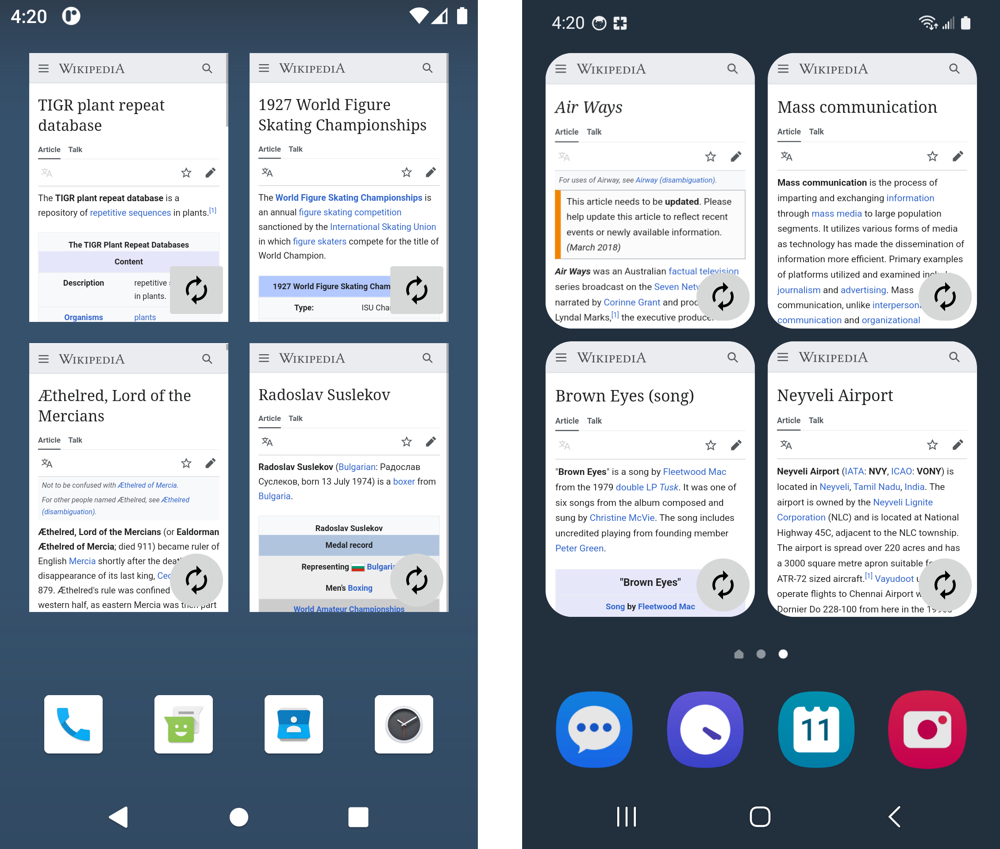

# Web Widgets

A demonstration of drawing rendered `WebView` content into App Widget images
along with various features, for both `RemoteViews` and Glance.

<!--suppress HtmlDeprecatedAttribute -->

<!--suppress CheckImageSize -->

This project contains complete working examples to supplement those outlined in
[this Stack Overflow post][so-post].

 

## Contents

- [Overview](#overview)
- [Readiness](#readiness)
- [Examples](#examples)
- [Notes](#notes)

 

## Overview

`WebView` must be attached to a `Window` before it will render anything. This
app demonstrates two slightly different ways to attach one offscreen, though
each has its own catch.

- Placing the `WebView` in a zero-size `FrameLayout` added directly to
  `WindowManager`. The collapsed container keeps everything hidden while we load
  and capture sites, but we have to have the `SYSTEM_ALERT_WINDOW` (overlay)
  permission to be able to put it there in the first place.

- Setting the `WebView` as the content of a `Presentation` hosted on a
  `VirtualDisplay`. This method doesn't require the overlay permission, but
  `WebView` itself will consistently log a particular (caught) `Exception` and
  stacktrace concerning an `InputMethodManager` mismatch. This is apparently
  unavoidable, apart from some really hacky hacks, and even frameworks like
  React Native are susceptible to it.

These options are realized in the implementations of
[`WebShooter`][web-shooter], one for each attach method:
[`OverlayWebShooter`][overlay-web-shooter] and
[`VirtualWebShooter`][virtual-web-shooter]. The latter is the default, and the
demo's `Activity` has a simple radio selection to switch between the two.

 

## Readiness

One of the trickiest parts of a general solution is figuring out when an
arbitrary page is ready to be drawn. Listening for the URL load to finish isn't
enough, so a `VisualStateCallback` must be used, but even that doesn't appear to
be sufficient a lot of the time.

The [platform CTS helper class][cts-helper] that was consulted for the
`postVisualStateCallback()` usage adds a `ViewTreeObserver.OnDrawListener` upon
the visual callback, and then invalidates to cause an extra frame before drawing
to ensure it's ready. The relevant platform test renders are extremely
simplistic, however, and they're pretty much guaranteed to be ready immediately.

Waiting for a complex render is a different matter, and it seemingly must
involve some guesswork no matter how it's handled. Presently, the available
options for the delay are defined in the
[`sealed interface DelayStrategy`][delay-strategy].

- `None` performs no delay after awaiting the initial page load and visual state
  callback.
- `Time` adds a simple (suspending) `delay()` with an exact duration.
- `Frames` waits for an additional number of display frames to elapse on the
  main thread, per `Choreographer`.
- `DrawIdling` monitors the `WebView`'s own `invalidate()` calls as a `Flow` and
  uses `debounce()` to guess when it's done updating itself.

For simple static pages, `None` can work perfectly well. Beyond that,
`DrawIdling` seems to be the most robust, at least in my simple tests, but it
also assumes a static page. If you're loading something with animations or
long-running scripts or the like, the `invalidate()` calls aren't going to be a
reliable indicator. `Time`'s delay is probably the most intuitive option after
that one, but there are likely cases where `Frames` makes more sense.

 

## Examples

Minimal examples of the virtual `Presentation` method for both frameworks can be
found in [the linked Stack Overflow post][so-post]. Similar examples for the
overlay method would be nearly identical, just with an added `FrameLayout` and
some `WindowManager` calls in place of the `Presentation` setup.

The repo currently contains a scrolling Widget with a reload button in both
frameworks, each capable of both the overlay and virtual methods:

- [`RemoteViewsWebWidget`][remoteviews-widget]
- [`GlanceWebWidget`][glance-widget]

On each update, these Widgets load random pages from Wikipedia. The captured
images are created to match the Widgets' actual widths, and their heights are
calculated to be (almost) as tall as is allowed by the API's size restrictions
for `Bitmap`s on `RemoteViews`. These tall images are then loaded as the only
item in a `LazyColumn` or `ListView`, since we don't have access to plain
scrolling containers in Widgets.

These examples assume that the page will load relatively quickly. Each one uses
only the time available to it from its own component; i.e., there are no
separate `Worker`s or loader `Service`s. In production, I'd suggest using
`Worker`s for most setups. [This official Glance sample][sample] has an
`ImageWorker` that's very close to what would be needed here. It also shows how
to serve images through a `FileProvider`, which is generally preferable to
sending on the `RemoteViews` directly.

 

## Notes

- The demo's Widgets aren't very smart about sizing. They will fall back to the
  minimum sizes specified in `<appwidget-provider>` if they haven't yet been
  updated with an actual size. This means that the first images loaded might not
  fit their Widgets correctly, but subsequent updates should fix that. It is
  possible to account for this, of course, but I've decided that the extra code
  necessary to do so just added confusion, so it's been removed.

- The demo `Activity` offers a simple radio button selection to choose between
  the virtual and overlay attachment options. The `RemoteViews` Widget can be
  refreshed immediately after changing, since it creates a new `WebShooter`
  instance for each broadcast. The Glance Widget, however, will have to be
  removed and replaced in order to ensure that the change takes effect right
  away. It involves a long-lived component that caches its `WebShooter`.

- All the Widgets currently use Wikipedia for their pages. I am not affiliated
  with The Wikimedia Foundation nor any of its sites or organizations. It is
  simply a reliable, lightweight site with a random page functionality. The
  reproductions of small sections of various Wikipedia articles used in this
  document's graphics are believed to constitute fair use.

 

## License

MIT License

Copyright (c) 2026 Mike M.

Permission is hereby granted, free of charge, to any person obtaining a copy of
this software and associated documentation files (the "Software"), to deal in
the Software without restriction, including without limitation the rights to
use, copy, modify, merge, publish, distribute, sublicense, and/or sell copies of
the Software, and to permit persons to whom the Software is furnished to do so,
subject to the following conditions:

The above copyright notice and this permission notice shall be included in all
copies or substantial portions of the Software.

THE SOFTWARE IS PROVIDED "AS IS", WITHOUT WARRANTY OF ANY KIND, EXPRESS OR
IMPLIED, INCLUDING BUT NOT LIMITED TO THE WARRANTIES OF MERCHANTABILITY, FITNESS
FOR A PARTICULAR PURPOSE AND NONINFRINGEMENT. IN NO EVENT SHALL THE AUTHORS OR
COPYRIGHT HOLDERS BE LIABLE FOR ANY CLAIM, DAMAGES OR OTHER LIABILITY, WHETHER
IN AN ACTION OF CONTRACT, TORT OR OTHERWISE, ARISING FROM, OUT OF OR IN
CONNECTION WITH THE SOFTWARE OR THE USE OR OTHER DEALINGS IN THE SOFTWARE.

[so-post]: https://stackoverflow.com/a/33981965
[web-shooter]: demo/src/main/kotlin/dev/gonodono/webwidgets/shooter/WebShooter.kt
[overlay-web-shooter]: demo/src/main/kotlin/dev/gonodono/webwidgets/shooter/OverlayWebShooter.kt
[virtual-web-shooter]: demo/src/main/kotlin/dev/gonodono/webwidgets/shooter/VirtualWebShooter.kt
[cts-helper]: https://cs.android.com/android/platform/superproject/main/+/main:cts/tests/tests/uirendering/src/android/uirendering/cts/util/WebViewReadyHelper.java
[delay-strategy]: demo/src/main/kotlin/dev/gonodono/webwidgets/shooter/DelayStrategy.kt
[remoteviews-widget]: demo/src/main/kotlin/dev/gonodono/webwidgets/remoteviews/RemoteViewsWebWidget.kt
[glance-widget]: demo/src/main/kotlin/dev/gonodono/webwidgets/glance/GlanceWebWidget.kt
[sample]: https://github.com/android/user-interface-samples/tree/main/AppWidget/app/src/main/java/com/example/android/appwidget/glance/image